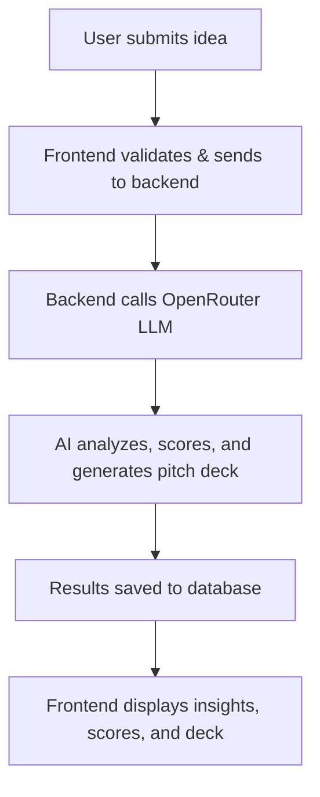

# 🚀 **StartupDeckAI**

<p align="center">
  
</p>

<p align="center">
  <b>AI-powered platform for instant startup validation</b>
</p>

<p align="center">
  
  
  
  
  
  
</p>

---

## ✨ **What is StartupDeckAI?**

**StartupDeckAI** is your AI co-founder for startup validation. Instantly analyze your business idea, get market insights, MVP suggestions, and generate a pitch deck—all powered by open-source LLMs. Perfect for creators, students, and indie hackers who want to move fast and impress investors.

---

## 💡 **Why StartupDeckAI?**

- **Save weeks of research:** Get actionable feedback, market data, and pitch materials in minutes.
- **Investor-grade output:** Generate professional pitch decks and validation reports.
- **No vendor lock-in:** 100% open-source, self-hosted, and privacy-first.
- **Empower everyone:** From solo founders to student teams, validate ideas with confidence.

---

## 🌟 **Features**

| 🚀 | **Instant Validation**: Get a viability score and actionable feedback in seconds |
|----|---------------------------------------------------------------------------------|
| 📊 | **Market Insights**: TAM/SAM/SOM, competitor analysis, and target audience         |
| 🛠️ | **MVP Ideas**: AI-generated MVP suggestions and tech stack recommendations        |
| 🎤 | **AI Pitch Deck**: One-click, investor-ready pitch deck generation                |
| 🔒 | **Privacy-First**: All processing is local or via your own OpenRouter key         |
| 🦄 | **Modern UI/UX**: Beautiful, responsive, and easy to use                         |
| 🧑‍💼 | **User Tiers**: Anonymous, free, and pro accounts with usage tracking           |
| 🌐 | **OAuth Ready**: Google, GitHub, Twitter (UI complete, backend coming soon)       |
| 📈 | **Usage Analytics**: Track validations and pitch deck generations                 |

---

## 👤 **Who is it for?**

- **🚀 Indie Hackers:** Validate and pitch new SaaS ideas before you code.
- **🎓 Students:** Ace entrepreneurship projects with real market data and pro decks.
- **🦸‍♀️ Creators:** Test product-market fit for your next big thing.
- **💼 Startup Teams:** Align on vision, market, and execution with AI-powered clarity.
- **🧑‍💻 Developers:** Build, fork, and extend a modern AI SaaS stack.

---

## 🛣️ **Roadmap**

- [x] AI-powered business validation & scoring
- [x] Automated pitch deck generation
- [x] Market, competitor, and audience analysis
- [x] Freemium authentication & usage tracking
- [x] Modern, responsive UI (shadcn/ui, Tailwind)
- [ ] Team collaboration (MVP)
- [ ] PDF export & sharing
- [ ] More LLM model options (OpenRouter, HuggingFace, etc.)
- [ ] Real-time feedback & chat (PitchGPT mode)
- [ ] More integrations (Notion, Slack, etc.)

---

## 🖼️ **Screenshots & Demo**

<p align="center">
  
  <br/>
  <em>✨ Replace with your own animated GIFs/screenshots for maximum wow! ✨</em>
</p>

---

## 🧑‍💻 **Tech Stack**

| Frontend   | Backend   | Database   | AI/LLM         | Styling      |
|------------|-----------|------------|----------------|--------------|
| Next.js    | Node.js   | Supabase   | OpenRouter/DeepSeek | Tailwind CSS |
| React      | Express   | PostgreSQL | (or any OpenRouter model) | shadcn/ui    |

---

## 🛠️ **How it Works**



---

## 📦 **Example Use Cases**

- **"I want to know if my app idea is worth building."**
- **"I need a pitch deck for my hackathon project—fast!"**
- **"Our student team needs market data for a business plan."**
- **"I want to impress investors with a data-driven, AI-generated deck."**
- **"I want to fork and build my own AI SaaS platform."**

---

## 🗣️ **Testimonials**

> "StartupDeckAI gave me a full market analysis and pitch deck in 2 minutes. I used it to win my university's startup competition!"  
> <sub>— Alex, Student Founder</sub>

> "I use StartupDeckAI to validate every new SaaS idea before I write a single line of code. It's my secret weapon."  
> <sub>— Priya, Indie Hacker</sub>

---

## 📝 **FAQ**

**Q: Is my data private?**  
A: Yes! All processing is local or via your own OpenRouter key. No data is shared with third parties.

**Q: Can I use my own LLM or API?**  
A: Yes! The backend is modular—swap in any OpenRouter-compatible model.

**Q: Is it really free?**  
A: 100% open-source (MIT). You can self-host, fork, and extend as you wish.

**Q: Can I export my pitch deck?**  
A: PDF export and sharing are on the roadmap!

**Q: How do I contribute?**  
A: See the [Contributing](#-contributing) section below.

---

## ⚡ **Quick Start**

```bash
# 1. Clone the repo
$ git clone https://github.com/trynayash/startupdeckai.git
$ cd startupdeckai

# 2. Install dependencies
$ npm install

# 3. Set up environment variables
$ cp .env.example .env
# Fill in your DATABASE_URL and OPENROUTER_API_KEY

# 4. Run the app
$ npm run dev
```

- Frontend: http://localhost:5173
- Backend: http://localhost:3000

---

## 🌐 **Live Demo**

> [🚀 Try StartupDeckAI Live](#) <!-- Replace with your live link -->

---

## 🤝 **Contributing**

We love contributions! To get started:

1. Fork this repo
2. Create a feature branch (`git checkout -b feature/your-feature`)
3. Commit your changes
4. Push and open a PR

**Ways to contribute:**
- Add new features or integrations
- Improve UI/UX or documentation
- Report bugs or suggest enhancements
- Share your use case or testimonial

Please see [CONTRIBUTING.md](CONTRIBUTING.md) for more details.

---

## 📄 **License**

MIT — free for personal and commercial use.

---

## 📬 **Contact & Credits**

- GitHub: [trynayash/startupdeckai](https://github.com/trynayash/startupdeckai)
- LinkedIn: [Nayash on LinkedIn](https://www.linkedin.com/in/your-linkedin/) <!-- Replace with your LinkedIn -->
- Built by [@trynayash](https://github.com/trynayash) and open-source contributors

---

<p align="center">
  
</p> 